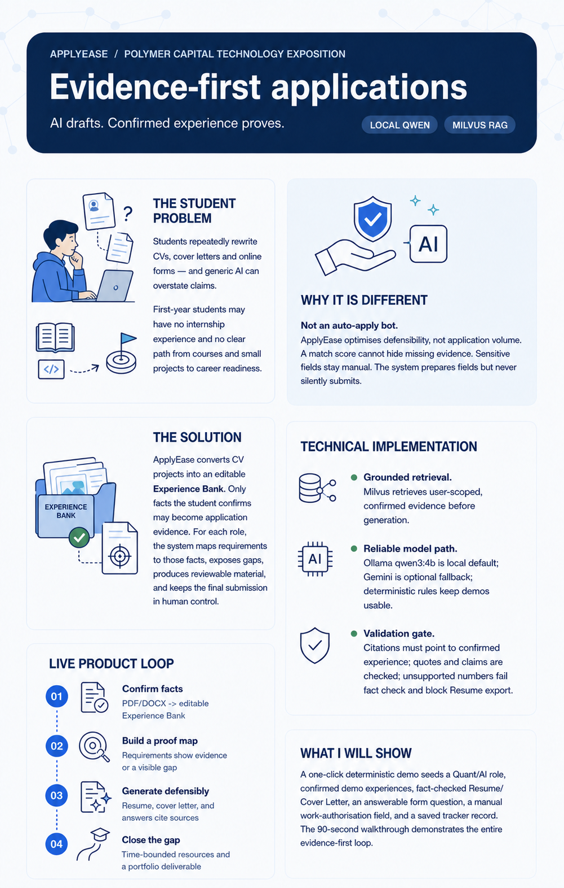

# ApplyEase — Evidence-First AI Application OS

> **AI drafts. Confirmed experience proves.**



ApplyEase is an AI-powered application and preparation workspace for university students. It turns real, confirmed experiences into role-specific applications and helps early-year students turn a career ambition into an achievable preparation plan.

## Judge demo: no account required

The default local Docker setup is configured for a frictionless judge demo:

- No sign-up, sign-in, email verification or MFA is required.
- The frontend runs with `VITE_AUTH_REQUIRED=false`.
- When no credential is supplied, the local backend uses a local demo account.

This mode is for a **local evaluator demo only**. Do not enter real personal data, API keys or private CVs into a shared or publicly hosted demo. Authentication remains available in the codebase and is enabled by the production Compose configuration.

## Quick start

### Prerequisites

- Docker Desktop with Docker Compose
- At least 4 GB of available memory for PostgreSQL, Milvus, backend and frontend containers

### Run locally

```bash
git clone https://github.com/YOUR_GITHUB_USERNAME/applyease.git
cd applyease

# Create local configuration only if it does not already exist.
# Never commit backend/.env.
cp .env.example backend/.env

docker compose up --build -d
```

Open [http://localhost:5173](http://localhost:5173). The API documentation is at [http://localhost:8000/docs](http://localhost:8000/docs).

```bash
# Stop the demo
docker compose down

# Stop and reset all local demo data
docker compose down -v
```

## Five-minute walkthrough

1. **Build an Experience Bank.** Open the experience library, upload a sample CV or add an experience manually. A first-year student can add coursework, class projects, hackathons, student societies, volunteering or personal projects — not only internships.
2. **Confirm evidence.** Review each extracted record and confirm it. Only confirmed experiences become AI evidence.
3. **Analyse a role.** In **Job Analysis**, paste a job description or import a public job link, then generate a requirement and evidence-gap report.
4. **Save the role.** Add the analysed role to its workspace to unlock tailored materials, tracking and preparation for that target.
5. **Generate reviewable materials.** In **Materials & Forms**, generate a resume, cover letter or application answer. Review the attached experience sources and fact-check result before using it.
6. **Close a gap.** In **Learning Plan**, select an objective and time budget. ApplyEase turns unsupported requirements into a practical resource and project plan with a possible CV outcome.
7. **Track the application.** In **Application Tracker**, add dates, status and follow-up actions. The job workspace keeps evidence, materials, forms and progress connected.

## The student problem

Students repeatedly rewrite CVs, cover letters and online forms for different roles. Generic AI can make a claim sound stronger than the student can honestly defend in an interview.

First-year students face an additional challenge: they may have no internship experience and no clear path from coursework or small projects to career readiness. ApplyEase treats this as a planning problem, not as a reason to fabricate experience.

## What ApplyEase does

1. **Build an Experience Bank.** Students upload a CV or add evidence manually. Every extracted record must be reviewed and confirmed before AI may use it.
2. **Analyse a target role.** The system extracts requirements and maps them to confirmed evidence, making support and gaps visible.
3. **Generate defensible materials.** Resume, cover-letter and application-answer generation is grounded in the current user's confirmed experiences through retrieval-augmented generation (RAG). Sources and fact checks make the result reviewable.
4. **Turn gaps into a plan.** When a student is not ready for a role, ApplyEase recommends a time-bounded learning and project plan with a concrete CV outcome.
5. **Keep users in control.** Sensitive fields such as identity, work authorisation and salary remain manual. ApplyEase never submits a third-party application automatically.

## Why it is different

ApplyEase optimises **defensibility**, not application volume. Every material claim should trace back to confirmed user evidence. The AI is deliberately constrained by prompts such as:

```text
Create application material using only the confirmed experiences supplied below.
Never invent employment, metrics, awards, dates, skills, or responsibilities.
```

The workflow supports both students with an existing CV and students who need a practical route to build one.

## Technical implementation

- **Frontend:** React, TypeScript and Vite
- **Backend:** FastAPI, Python, Pydantic, SQLAlchemy and PostgreSQL
- **AI:** Qwen3:4B through Ollama by default; optional DashScope (Qwen) or Google Gemini fallback and explicit-consent OCR
- **Grounding:** user-scoped RAG with Milvus vector search and a deterministic local fallback
- **Opportunity research:** Bocha Web Search API plus official applicant-tracking-system sources
- **Deployment:** Docker Compose

## Optional AI configuration

ApplyEase remains usable with deterministic fallbacks if no model is configured. To enable optional model-backed generation or research, add only your own secrets to the untracked `backend/.env` file:

```env
AI_EXTRACTION_ENABLED=true
AI_JOB_ANALYSIS_ENABLED=true
AI_MATERIAL_GENERATION_ENABLED=true
AI_APPLICATION_FORM_ENABLED=true

# Optional cloud fallback / opt-in OCR
GEMINI_API_KEY=your_key_here

# Optional Alibaba Cloud Model Studio text generation. Copy the exact
# workspace-specific "OpenAI compatible" URL shown on its API Key page.
LLM_PROVIDER=dashscope
LLM_FALLBACK_PROVIDER=ollama
DASHSCOPE_API_KEY=your_workspace_key_here
DASHSCOPE_BASE_URL=https://your-workspace.example/compatible-mode/v1
DASHSCOPE_MODEL=qwen-plus

# Optional Opportunity Radar web research
BOCHA_SEARCH_API_KEY=your_key_here
```

Never use `VITE_` variables for API keys, and never commit `.env`, `.env.production`, database files, uploads or generated mailboxes.

## Test and build

```bash
# Backend
cd backend
PYTHONPATH=. .venv/bin/pytest -q

# Frontend (from a separate terminal)
cd frontend
npm test
npm run build

# Browser extension
cd browser-extension
npm test
npm run build
```

## Public repository checklist

Before pushing this repository publicly:

1. Verify that `backend/.env`, `.env`, `.env.production`, database files, uploads and mailboxes are ignored.
2. Search staged files for secrets:

   ```bash
   git grep -n -E '(API[_-]?KEY|SECRET|PASSWORD|TOKEN)=' -- ':!*.example' || true
   ```

3. Keep only placeholder values in `.env.example` and `.env.production.example`.
4. Enable GitHub secret scanning and push protection after creating the repository.
5. Use the local no-login judge demo for evaluation. For a real public deployment, use the secure production configuration and do not expose personal applicant data.

## Scope and responsible use

The evidence-confirmation workflow, role analysis, grounded material generation, fact checks, application tracking and preparation planning are implemented. Next steps are claim-span-level provenance, broader CV/job-description evaluation and more refined opportunity ranking.

ApplyEase does not guarantee interviews or outcomes. It does not create experiences a student has not earned, and it does not automatically submit applications. Users should review every generated output before using it.
