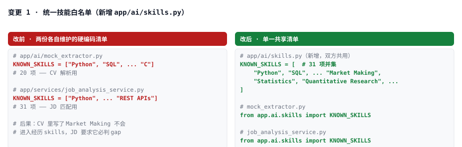
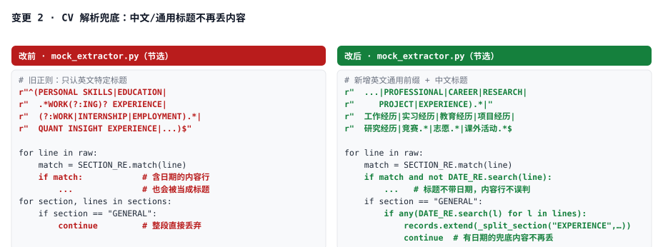
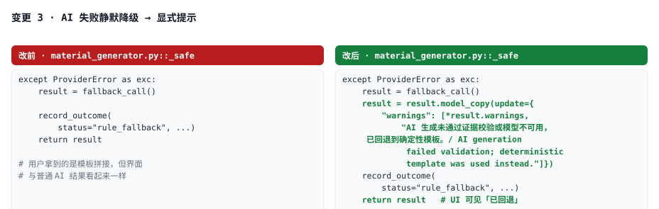
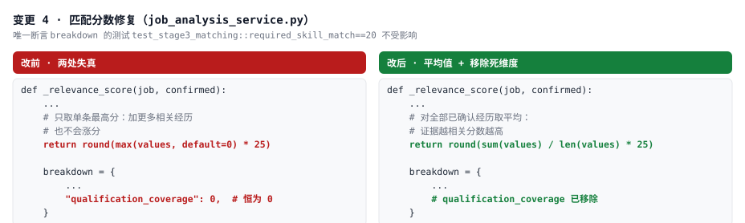

# ApplyEase 优化点与代码变更记录（2026-08-31）

> 承接《ApplyEase_评审报告.md》。本文档记录本次**实际落地的 5 项修改**、前后对比图与测试结果。
> 修改均在 `~/Desktop/2026暑假/polymer project/backend/`，已通过全量测试验证。

---

## 一、本次修改总览

| # | 优化点 | 严重度 | 改动文件 |
|---|---|---|---|
| 0 | git 跟踪了 174 个过期 `.pyc` 字节码，源码修改可能不生效 | 🔴 构建 | `.gitignore` + git 索引 |
| 1 | 技能白名单两处硬编码且不一致（20 vs 31 项） | 🔴 P0 | 新增 `app/ai/skills.py`；`mock_extractor.py`、`job_analysis_service.py` |
| 2 | CV 解析只认特定英文标题，简体/繁體/通用 CV 内容被整段丢弃 | 🔴 P0 | `app/ai/mock_extractor.py` |
| 3 | AI 失败静默降级为模板拼接，用户无从分辨 | 🔴 P0 | `app/ai/material_generator.py` |
| 4 | 匹配分数失真：relevance 只取单条最高分、恒 0 的死维度 | 🟡 P1 | `app/services/job_analysis_service.py` |
| 5 | 新增 8 个回归测试锁住以上行为 | — | `tests/test_review_fixes.py` |

---

## 二、变更 0：修复字节码缓存地雷

**问题**：git 索引里跟踪了 174 个 `backend/**/*.pyc`（`.gitignore` 原规则 `backend/app/**/__pycache__/` 匹配不到 `migrations/`、`tests/` 等路径）。这些 .pyc 是 hash-based 编译产物，**源码更新后 Python 仍会加载过期字节码**——本次调试中实际踩中：改了 `mock_extractor.py` 后行为一直不变，直到清掉 `__pycache__`。

**修复**：`git rm --cached` 移除索引（工作区文件保留），`.gitignore` 追加 `**/__pycache__/`、`*.pyc`、`.pytest_cache/`。已验证 `git check-ignore` 生效，索引中 pycache 数量归零。

## 三、变更 1：统一技能白名单

- 新增 `backend/app/ai/skills.py`，两处共用同一份 `KNOWN_SKILLS`（31 项并集）。
- 效果：CV 里出现 `Market Making` / `Statistics` / `Quantitative Research` 现在能正确挂到经历上，与 JD 匹配口径一致。

## 四、变更 2：CV 解析兜底

`app/ai/mock_extractor.py` 三处修复：

1. **放宽标题正则**：新增 `PROFESSIONAL / CAREER / RESEARCH / PROJECT / EXPERIENCE` 前缀，以及简体（工作经历/实习经历/教育经历/项目经历/研究经历/竞赛/志愿/课外活动等）与**繁體中文**（工作經歷/實習經歷/教育經歷/專案經歷/專題研究/學歷/競賽/獲獎/志願/課外活動/社團等）标题。
2. **含日期的行不再误判为标题**（调试中发现 `RESEARCH.*` 会吞掉 "Research Assistant, 06/2024…" 这样的内容行）。
3. **GENERAL 兜底**：未识别标题但含日期条目的段落不再整段丢弃；`Role | Company` 格式的标题行会拆出职位名作为 title、公司作为 organization；标题中的日期自动去除。

## 五、变更 3：AI 降级显式提示

`app/ai/material_generator.py::_safe`：AI 生成因引用校验失败/模型不可用而回退模板时，现在会在结果的 `warnings` 中追加双语提示「AI 生成未通过证据校验或模型不可用，已回退到确定性模板」。简历、求职信、申请题答案三条链路（materials + application answers）全部覆盖。

## 六、变更 4：匹配分数修复

`app/services/job_analysis_service.py`：
- `_relevance_score` 从「单条经历最高分」改为「全部已确认经历的平均分」——此前加再多的相关证据也不会涨分。
- 移除恒为 0 的 `qualification_coverage` 死维度（前端动态遍历 breakdown 渲染，删 key 无兼容问题）。

## 七、变更 5：回归测试

新增 `backend/tests/test_review_fixes.py`，9 个用例：

1. `test_skill_vocabulary_is_shared_and_superset` — 共享清单是两份旧清单的超集
2. `test_extractor_keeps_generic_experience_headings` — `PROFESSIONAL EXPERIENCE` 不再丢
3. `test_extractor_handles_chinese_cv_headings` — 简体中文 CV 产出 education + internship
4. `test_extractor_handles_traditional_chinese_cv_headings` — 繁體中文 CV（教育經歷/實習經歷/專題研究）产出 education + internship + research，且实习标题不含日期区间
5. `test_extractor_recovers_dated_general_content` — 无任何可识别标题时兜底不丢
6. `test_extractor_strips_dates_from_titles_when_content_remains` — 标题去日期
7. `test_skill_union_reaches_matching` — Market Making 能挂到经历 skills
8. `test_fallback_material_reports_that_ai_was_not_used` — 降级必带警告
9. `test_match_report_relevance_is_average_and_dead_dimension_removed` — 平均分 + 死维度移除

## 八、测试结果

| 阶段 | 结果 |
|---|---|
| 修改前基线（全量） | **203 passed, 1 failed**, 16 warnings（50s） |
| 修改后（全量） | **212 passed, 1 failed**, 16 warnings（繁体用例加入后 +9）✅ |

⚠️ 唯一失败的 `test_api_architecture.py::test_api_modules_do_not_import_orm_models_or_query_the_database_directly` 在**修改前就存在**（`api/v1/jobs.py` 直接 import 了 `app.models.job.Job` 用于 analyze-preview 的瞬态对象），与本次改动无关，未纳入本次范围。要修的话需把 preview 构造挪进 service 层，约 30 分钟工作量。

## 九、未纳入本次、建议后续做的

按评审报告优先级：RAG 增量索引（Milvus 每次检索全量重 embed，最大性能债）→ fact-check 升级为 claim 级 → `generate-all` 后台化 → 前端 AI/规则模式徽章。详见《ApplyEase_评审报告.md》。

---

*所有改动未 commit（pycache 移除已进 staging area），可在项目目录 `git diff` 审阅后自行提交。*
