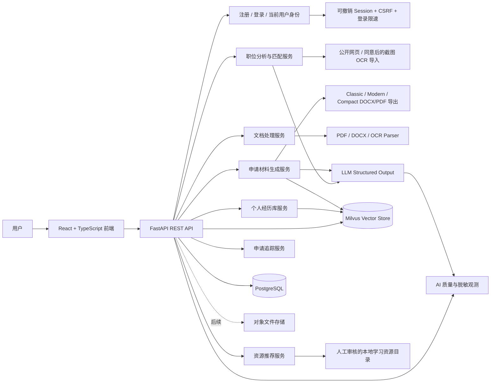

# ApplyEase 代码架构

ApplyEase 是一个面向大学生实习申请的 AI 操作系统：它将职位要求、个人经历和申请表问题连接起来，生成有真实证据依据的申请材料，并为技能缺口提供学习与项目建议。

## 1. 整体系统架构



上传文档会以 SHA-256 建立唯一指纹，并创建一个 `Document` 批次记录；经历通过 `document_id` 关联来源文档。重复文件返回已有结果，不重复写入经历。

阶段九在业务路由入口解析当前用户，并把 `current_user_id` 放入 SQLAlchemy Session；Session 级查询过滤器自动限制 Document、Experience、Job、Material、Application/Question、ResourceProgress、Tracker 和阶段十 AIInvocation，新增记录在 flush 前自动取得 owner。阶段十一把认证凭证升级为可撤销 `AuthSession`：网页走 HttpOnly Cookie + CSRF，扩展走 Bearer。development/test 仅在完全没有凭证时保留 legacy local user；无效或过期凭证永远返回 401。

阶段十通过 `ai/observability.py` 的 request trace 统一关联 Provider 尝试与最终功能结果。`prompt_versions.py` 集中管理稳定版本名；`ai_invocations` 只存功能、模型、版本、耗时、尝试、字符数量和错误类别，不存用户内容。`crud/ai_observation.py` → `services/ai_observation_service.py` → `api/v1/ai_observability.py` 负责按当前用户聚合 1–90 天指标，前端 `AIQualityPage` 只展示脱敏汇总。

阶段十一的 `models/security.py` 包含 `AuthSession` 与内部 `SecurityAudit`；认证 API 仍通过 `crud/security.py` 和 `crud/user.py` 访问数据库。Session token、CSRF、email、IP 和 User-Agent 原值不落库。FastAPI middleware 负责 Host/HTTPS 边界与 API 安全头，Nginx 负责静态前端 CSP。生产 TLS 在受信反向代理终止，并由其覆盖/净化 `X-Forwarded-Proto`。

## 2. 前端目录

```text
frontend/
├── src/
│   ├── App.tsx              # 页面导航与全局工作流
│   ├── pages/               # Dashboard、Profile、JobAnalysis 等页面
│   ├── components/          # 可复用 UI 和业务组件
│   ├── services/            # API client 和请求封装
│   ├── types/               # TypeScript 类型定义
│   └── main.tsx             # React 入口
├── package.json
├── tsconfig.json
└── vite.config.ts
```

## 3. 后端目录

```text
backend/
├── app/
│   ├── main.py              # FastAPI 入口
│   ├── config.py            # 环境变量和配置
│   ├── api/v1/              # REST endpoints
│   ├── schemas/             # Pydantic request/response schemas
│   ├── models/              # SQLAlchemy 数据模型
│   ├── services/            # 业务服务层
│   ├── ai/                  # Ollama/Gemini、Structured Output、评估与观测
│   ├── parsers/             # PDF、DOCX、TXT/MD 文本解析
│   ├── crud/                # 数据库 CRUD 操作层
│   ├── db/                  # session、migration helpers
│   └── cli.py               # db upgrade/check/wait
├── migrations/              # Alembic revisions
├── tests/
├── requirements.txt
├── Dockerfile
└── alembic.ini
```

## 4. 核心数据流

### 个人经历库

```text
上传 CV → PDF/DOCX/TXT/MD 解析 → 规则/LLM 结构化提取 → 用户确认/编辑 → Experience Bank
```

每项经历至少包含：标题、组织、描述、技能、成果、可验证来源和用户确认状态。经历库还提供搜索、确认状态筛选、分页、手动新增、重复检测和批量确认。生成内容只能引用已确认的经历。

### 职位分析

```text
粘贴职位描述 → Requirements Parser → 技能与申请要求 → 经历匹配 → 匹配报告
```

职位分析支持粘贴文本、公开 HTTPS 职位页和经同意的职位截图。网页导入先做 scheme、凭据和 DNS 公网地址检查，再以不跟随跳转、10 秒超时、2 MB 流式上限读取 HTML，清理 script/style 后生成不落库的职位草稿；截图复用 Gemini OCR 的 MIME、文件签名、5 MB 和显式同意边界。用户必须审核草稿并点击分析，才会创建 Job。LLM Structured Output 加确定性 fallback 提取必需技能、加分技能、职责和资格；匹配服务支持目录外技能的直接证据匹配，只使用 `confirmed=true` 的经历，并输出必需/加分缺口、分数构成、警告和逐项原文 quote。

### 申请材料生成

```text
职位 ID + 已确认经历 → Resume / Cover Letter / 申请题生成器 → 字数检查 + 数字事实检查 + 来源引用
```

阶段四使用 `material_service` 统一编排 AI 与规则生成，结果写入 `generated_materials` 作为版本；只允许已确认经历进入 prompt 和来源列表，AI 的 claim/quote/Experience ID 会经过事实校验，数字不在职位描述或经历证据中时触发 fallback。答案字符上限会随版本保存并在人工编辑时再次校验。

阶段十三在已保存 Resume 版本之后加入独立 `resume_export_service`。用户选择模板并临时提供姓名/联系方式，服务只排版当前材料文本，不重新生成事实；事实检查失败时拒绝导出。DOCX 由 `python-docx` 生成，PDF 由 ReportLab 生成，Classic/Modern/Compact 使用明确 Letter 页面、边距、字体和行距；中英文 PDF 采用英文标准字体加 CJK fallback。可选来源附录单独分页，姓名和联系方式不写数据库。

### 申请表 Copilot

```text
职位 ID + 申请页面文字/截图 → 服务层问题识别、分类和限制解析 → 已确认经历检索 → 答案生成/用户填写 → 来源、字数和事实检查
```

网页端支持粘贴文本、经明确同意上传截图、生成和人工编辑答案；浏览器扩展在用户预览并勾选后填充 `ready` 字段。系统不自动点击或提交第三方招聘网站。

### 申请追踪

```text
公司/职位/日期/状态/备注 → Tracker API → CRUD → PostgreSQL
                                      ↓
                     逾期/待跟进标记 + 下一步行动 + 状态汇总
                                      ↓
                 前端筛选、排序、编辑、确认删除与提醒
```

### 资源与行动计划

```text
职位匹配缺口 → 人工审核资源目录 → 官方链接 + 难度/时长 → 实战项目 + 完成标准 → 标记完成
```

资源推荐使用人工审核的本地目录，按缺口技能、用户水平和时间预算排序，并返回命中技能与推荐理由；目录支持幂等补种，完成状态保存于 `resource_progress`。

## 5. 当前 API

```text
POST /api/v1/auth/register
POST /api/v1/auth/login
GET  /api/v1/auth/me
GET  /api/v1/auth/sessions
POST /api/v1/auth/logout
POST /api/v1/auth/logout-all
POST /api/v1/auth/email-verification/request
POST /api/v1/auth/email-verification/confirm
POST /api/v1/auth/password/forgot
POST /api/v1/auth/password/reset
GET  /api/v1/auth/mfa
POST /api/v1/auth/mfa/setup
POST /api/v1/auth/mfa/confirm
POST /api/v1/auth/mfa/login/verify
POST /api/v1/auth/mfa/recovery-codes
POST /api/v1/auth/mfa/disable

POST /api/v1/documents/upload
GET  /api/v1/experiences
POST /api/v1/experiences
POST /api/v1/experiences/bulk-confirm
PATCH /api/v1/experiences/{id}
DELETE /api/v1/experiences/{id}

POST /api/v1/jobs/analyze
POST /api/v1/jobs/import-url
POST /api/v1/jobs/import-screenshot
GET  /api/v1/jobs/{id}
GET  /api/v1/jobs/{id}/match-report

POST /api/v1/applications/questions/detect
POST /api/v1/applications/questions/detect-screenshot
GET  /api/v1/applications/{id}
POST /api/v1/applications/{id}/questions/{question_id}/answer
POST /api/v1/applications/{id}/answers/generate-all
POST /api/v1/applications/{id}/fill-preview
PATCH /api/v1/applications/{id}/questions/{question_id}/answer

POST /api/v1/materials/resume/generate
POST /api/v1/materials/cover-letter/generate
POST /api/v1/materials/answer/generate
GET  /api/v1/materials
PATCH /api/v1/materials/{id}
POST /api/v1/materials/{id}/export
GET  /api/v1/applicant-profile
PUT  /api/v1/applicant-profile
DELETE /api/v1/applicant-profile

GET  /api/v1/resources/recommendations
POST /api/v1/resources/{id}/complete
GET  /api/v1/tracker/applications
GET  /api/v1/tracker/applications/summary
GET  /api/v1/tracker/applications/reminders?days=14
GET  /api/v1/tracker/applications/{id}/calendar
POST /api/v1/tracker/applications
PATCH /api/v1/tracker/applications/{id}
DELETE /api/v1/tracker/applications/{id}
GET  /api/v1/dashboard/summary
GET  /api/v1/ai/metrics?days=30
```

## 6. 关键设计原则

- Evidence-grounded：生成材料只使用已确认经历，并显示材料级来源、claim/quote 与事实检查结果；逐句引用属于后续增强。
- Human-in-the-loop：用户确认后才写入经历库或使用材料。
- No fabrication：没有证据时明确标记为缺失，不自动编造。
- Privacy-first：CV、成绩和身份资料应隔离存储并支持删除。
- 可量化：当前记录 AI 成功率、fallback、延迟和失败类别；材料制作时间、关键词覆盖率历史和用户修改次数属于后续产品分析增强。

阶段十七以 `mfa_configurations` 保存每用户的认证器配置，TOTP secret 使用从 `AUTH_SECRET` 派生的加密与完整性保护保存；`mfa_recovery_codes` 仅保存 HMAC，不保存恢复码原文。密码登录命中 MFA 时只签发 5 分钟一次性挑战 token，验证成功后才创建 Cookie/Bearer Session；恢复码轮换和关闭 MFA 需要再次验证当前 TOTP/恢复码。

对象文件存储、WebAuthn/passkey 和第三方日历 OAuth 写入仍是后续架构选项。Milvus 向量检索/RAG 已用于材料生成前的证据检索，服务不可用时会安全降级为已有的文本相关性与规则路径。

## 7. 阶段十二账号生命周期架构

阶段十二已在现有 `User`、`AuthSession`、`SecurityAudit` 和 Cookie/CSRF 基础上增加 `email_verified_at` 与 `AccountToken`。验证和重置 token 原文只通过邮件交付，数据库仅保存 `AUTH_SECRET` HMAC、用途、有效期和消费时间；同用户同用途的新 token 会使旧 token 失效，成功使用后不能重放。密码重置会重新哈希密码并撤销该用户全部旧 Session。

`account_lifecycle_service.py` 编排 token 和账号状态，`email_service.py` 隔离邮件交付。development 使用权限受限、Git 忽略的文件 mailbox；production 配置校验强制 SMTP、HTTPS 前端 URL 和邮箱验证。公开请求使用统一响应防止邮箱枚举，请求次数按邮箱/IP HMAC 限速，无效 token 尝试按 IP 限速，审计不保存邮箱、token 或邮件正文。TOTP MFA 与恢复码已实现；后续可增加 WebAuthn/passkey，不会改变 Experience Bank、证据约束生成或浏览器扩展人工确认填充的产品设计。

## 8. 阶段十三 Resume 导出架构

`ApplicationBuilderPage` 管理选中材料版本、模板、临时抬头资料和来源附录开关；`materialApi.downloadResume` 通过 POST JSON 请求二进制响应，读取暴露的 `Content-Disposition` 文件名并触发浏览器下载。后端 `api/v1/materials.py` 只负责所有权/类型/事实检查边界和响应，模板布局集中在 `services/resume_export_service.py`，没有新增数据库表或 migration。

导出请求仅接受 `docx|pdf`、`classic|modern|compact`、1–100 字姓名、最多 300 字单行联系方式和布尔来源开关。文件名只使用经过清洗的公司/职位/模板；跨用户记录按既有 owner filter 返回 404。下一步若做浏览器分页预览，应复用同一份规范或由后端提供预览文件，避免 UI 与下载版式漂移。

## 9. 阶段十四 Applicant Profile 与 Resume 预览

`applicant_profiles` 以 `user_id` 为主键，只保存用户明确选择保存的 `display_name` 与 `contact_line`；支持读取、覆盖和删除，资料不会在生成 Resume 时自动写入。Application Builder 将当前 Resume 文本按全大写标题划分区块，用户可显示/隐藏、上移/下移；`section_order` 和 `hidden_sections` 同时传给预览和导出服务。后端只接受现有标题，忽略未知区块，若所有区块均被隐藏则拒绝导出。预览根据模板密度估算行数并提示可能一页溢出，最终文件仍以 DOCX/PDF 的真实分页为准。
